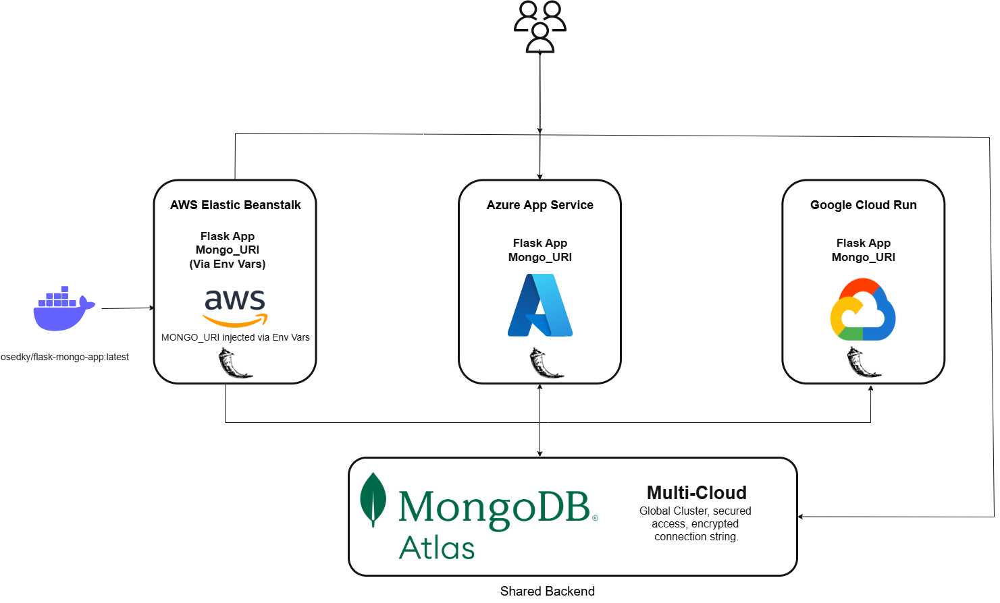

# 🌍 MongoDB Atlas Multi-Cloud Deployment Using Docker Containers

This project demonstrates how to deploy a containerized Flask application connected to MongoDB Atlas across **three major cloud providers**: **AWS**, **Azure**, and **Google Cloud Platform**. It highlights portability, secure environment management, and full-stack multi-cloud deployment using a shared backend.

---

## 📑 Table of Contents
1. [Architecture Overview](#architecture-overview)
2. [Problem This Solves](#problem-this-solves)
3. [Live Multi-Cloud Demo](#live-multi-cloud-demo)
4. [How It Was Built](#how-it-was-built)
5. [Business Impact](#business-impact)
6. [Cost & Security Considerations](#cost--security-considerations)
7. [Well-Architected Framework Alignment](#well-architected-framework-alignment)
8. [Challenges & Solutions](#challenges--solutions)
9. [Screenshots](#screenshots)
10. [Project Structure](#project-structure)
11. [Contact](#contact)

---

## 🧭 Architecture Overview

This architecture uses **Docker Hub** to host a reusable container image, deployed to:

- ✅ AWS Elastic Beanstalk  
- ✅ Azure App Service  
- ✅ Google Cloud Run  

All deployments connect to a **shared MongoDB Atlas cluster** using environment variables. Secrets are not hardcoded and deployments are reproducible.



---

## 🚩 Problem This Solves

Deploying the same application across multiple clouds is traditionally complex and siloed. This project:
- Solves **vendor lock-in** by using a unified container image
- Enables **consistent application behavior** across clouds
- Demonstrates **secure backend connectivity** via MongoDB Atlas

---

## 🌍 Live Multi-Cloud Demo

- 🔗 [Google Cloud Run Deployment](https://flask-mongo-app-765629656028.us-central1.run.app)
- 🔗 [Azure Web App Deployment](https://flaskmongo-azure-app-edhvedbvhbhda7d5.westus2-01.azurewebsites.net)
- 🔗 [AWS Elastic Beanstalk Deployment](http://flask-mongo-app.eba-hkezzhmq.us-east-1.elasticbeanstalk.com)

---

## 🔧 How It Was Built

- Flask app uses Python and Jinja2 templating
- Dockerized and pushed to Docker Hub: `osedky/flask-mongo-app:latest`
- `.env` file used locally to load `MONGO_URI`
- Each cloud deployment injects the URI as an environment variable
- MongoDB Atlas backend cluster secured and IP-restricted
- Deployments triggered manually on each cloud platform using native tools

---

## 💼 Business Impact

- ✅ Enables rapid multi-cloud PoC deployments
- ✅ Helps teams validate resilience and latency across regions
- ✅ Demonstrates real-world secure integration with a cross-cloud backend
- ✅ Proves Docker portability in production-grade stacks

---

## 💰 Cost & 🔐 Security Considerations

- MongoDB Atlas used in **free tier**, with tight IP access controls
- All cloud platforms used free-tier compute (t3.micro, B1s, etc.)
- No secrets stored in code or version control
- `.env` excluded via `.gitignore`
- Docker image is public, but credentials are externalized

---

## ✅ Well-Architected Framework Alignment

| Pillar                  | Decision Rationale |
|--------------------------|--------------------|
| **Security**            | Secrets externalized; backend secured by IP |
| **Reliability**         | Multiple clouds ensure resiliency |
| **Performance Efficiency** | Regionally distributed deployment |
| **Cost Optimization**   | Free-tier compute + open container model |
| **Operational Excellence** | Same image reused across platforms |

---

## 🛠 Challenges & Solutions

| Challenge | Solution |
|----------|----------|
| Elastic Beanstalk rejected Dockerrun v2 | Switched to v1 format |
| EB zip uploads failed | Corrected structure to place `Dockerrun.aws.json` at root |
| IAM policy blocked deletion | Resolved by modifying `s3:DeleteBucket` Deny |
| Special characters in password | Encoded `%21` for `!` in URI |
| Docker build local vs deploy parity | Validated with `flask run`, `docker run`, and all platforms |

---

## 🖼 Screenshots

| Screenshot | Description |
|------------|-------------|
| `01-create-cluster-screen.png` | MongoDB Atlas cluster creation |
| `06-docker-image-built.png` | Docker image build and tag |
| `13-dockerhub-image-push.png` | Image pushed to Docker Hub |
| `14-azure-webapp-success-multicloud.png` | Azure deployment confirmation |
| `25-success-aws-flask-mongodb.png` | Elastic Beanstalk successful deployment |
| `11-flask-gcp-deployment-success.png` | GCP Cloud Run deployment confirmation |

---

## 📁 Project Structure

```
Project-02-MongoDB-Atlas-Multi-Cloud-Deployment/
├── flask-app/
│   ├── app.py
│   ├── Dockerfile
│   ├── requirements.txt
│   ├── index.html
├── .env.template
├── Dockerrun.aws.redacted.json
├── Screenshots/
├── README.md
├── .gitignore
```

---

## 📬 Contact

- 🌐 [Portfolio – Sedky.net](https://sedky.net)
- 💼 [LinkedIn – Omar Sedky](https://www.linkedin.com/in/omarsedky)
- 💻 [GitHub – @oSedky](https://github.com/oSedky)
- ✉️ omar@sedky.net
